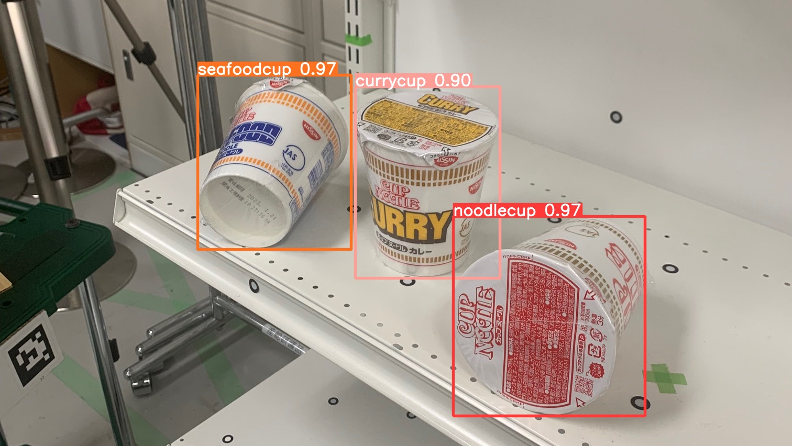

# 2D-detection



This repo allows the detection of targeted objects on a camera stream, in combination with the [6D-pose-estimation](https://github.com/isri-aist/6D-pose-estimation) repo. It also contains the code for synthetic dataset generation and training of the detection network.

## Features

- Fast detection of an object from any angle.
- Synthetic dataset generation allows training with only a couple of PNG images of the object, no annoted images are necessary.
- Basic GUI to launch the detection process on user-will and send the result to the 6D-pose-estimation part.

## Installation

- Tested with Ubuntu 20.04 / ROS Noetic
- All required packages are listed in `environment.yaml`. We recommend using a conda virtual environment to install them using the following command:

```bash
conda env create -f environment.yaml
```

## Usage

If you only want to use an already trained model, skip to step 3.

1. Dataset generation

First, be sure to gather necessary raw data.
- For backgrounds samples, you can download any large dataset of images. For instance, the 2017 Val Images from [COCO dataset](https://cocodataset.org/#download). Put the images in `raw_data/background_samples`.
- For the objects to detect, make one folder per object in `raw_data/objects_to_detect`, containing all PNG images of this object. Make sure to remove the background before. Several tools can do it easily, such as [rmbg](https://github.com/danielgatis/rembg).
- For random_objects (recommended to avoid overfitting), you can use any dataset of isolated objects on PNG images.

Then, copy the template folder `empty_custom_dataset` in `yolov8/dataset` and rename the copy as `custom_dataset`. 
Make sure that the objects in `raw_data/objects_to_detect` corresponds to the list of objects in `custom_dataset/data.yaml` and to the `object_classes_dict` in `generate_dataset.py`.
Finally, launch the dataset generation:
```python
python generate_dataset.py
```

2. Training

Train using the yolo CLI from your `custom_dataset`. You can adjust the batch size depending on your GPU.

```bash
yolo detect train data=data.yaml model=yolov8s.pt epochs=100 imgsz=640 batch=8
```
Copy the resulting network `yolov8/dataset/custom_dataset/runs/detect/train/weights/best.pt` into `yolov8/trained_models` to use it.

3. Detection 

From the main folder, run this command line:
```bash
python yolov8/ros_script.py
```
Open another shell in the same folder and run:

```bash
python yolov8/command_node.py
```

## References

This detection system was developed by Virgile Foussereau at the CNRS-AIST Joint Robotics Laboratory in collaboration with Guillaume Caron and Iori Kumagai.

If you use this repository, please cite the below paper:

Virgile Foussereau, Iori Kumagai, Guillaume Caron. Towards Retail Stores Automation: 6-DOF Pose Estimation Combining Deep Learning Object Detection and Dense Depth Alignment. IEEE/SICE International Symposium on System Integration, IEEE; SICE, Jan 2024, Ha Long, Vietnam. [PDF](https://hal.science/hal-04306460)
